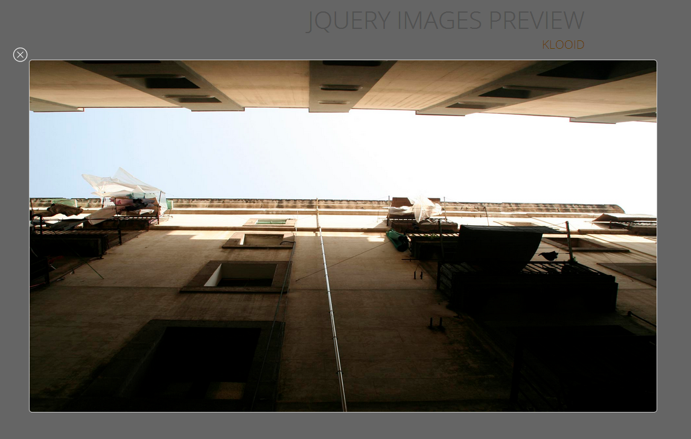

Galería de imágenes con jQuery muy facil de usar.
 

<a target="_new" href="http://fufales.com/frameworks/jQueryImagesPreview/">
DEMO ONLINE
</a>

Resumen
=======
- <b>Archivos importantes que debémos indexar:</b>
 
<b>js</b> / <code>jquery.imagespreview.js</code> : Archivo que contiene nuestro plugin. 
<b>css</b> / <code>imagespreview.css</code> : Archivo que contiene los estilos de nuestro plugin. 
<b>img</b> / <code>close_window.png</code> : Icono para cerrar la ventana del popup. 
<b>img</b> /<code> repead_jque_img.png</code> : Imagen que crea la parte negra del popup. 
 
- <b>Uso</b>

        
        	
        
<code>data-loadimgjpreview</code> es la URL de la imagen que querémos cargar.

Screens
=======

 

Instalacion y archivos importantes
==================================

- Lo primero que requerímos para usar el plug-in es <b>jQuery</b>, así que lo añadirémos antes del final de la etiqueta <code> "aquí" /body </code>

              
              
- Ya instalado jQuery en nuestro index; podémos en ese caso instalar nuestra Galería añadíendo los siguientes archivos  
<b>js</b> / <code>jquery.imagespreview.js</code> : Archivo que contiene nuestro plugin. 
<b>css</b> / <code>imagespreview.css</code> : Archivo que contiene los estilos de nuestro plugin. 
<b>img</b> / <code>close_window.png</code> : Icono para cerrar la ventana del popup. 
<b>img</b> /<code> repead_jque_img.png</code> : Imagen que crea la parte negra del popup. 

- Una vez instalado todo, se debería ver el HTML de la siguiente forma (Leér los comentários del HTML):

        <!DOCTYPE html>
        <html lang="es">
        <head>
        	<meta charset="utf-8">
        	<title>jQuery Images Preview</title>
        	<link rel="stylesheet" type="text/css" href="css/imagespreview.css"> /*CSS del plug-in*/
        </head>
        <body>
        
         /*jQuery requerido*/
         /*Plug-in requerido*/
        </body>
        </html>
        
- Ahora solo nos queda implementar la galería con los enlaces de la siguiente forma:

        
        	
        
        
Lo interesante es que lo único que tenemos que hacer es modificar ésta linea => <code>data-loadimgjpreview="img/images/img1.jpg"</code> en la cual se escribe la URL del archivo, puede ser cualquier URL de una imagen, no importa el formato.

y con respecto a la imagen <code> img src="img/image_1.jpg " alt="img" </code> : Es solo un preview para no sobre cargar nuestra pagina web y estámos listos para usarlo.

<b>Por</b> <i>Klooid.com</i>
